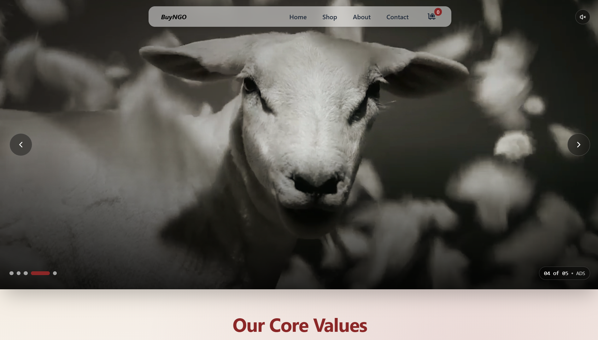
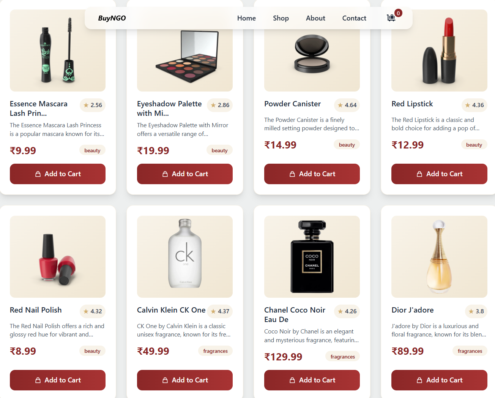
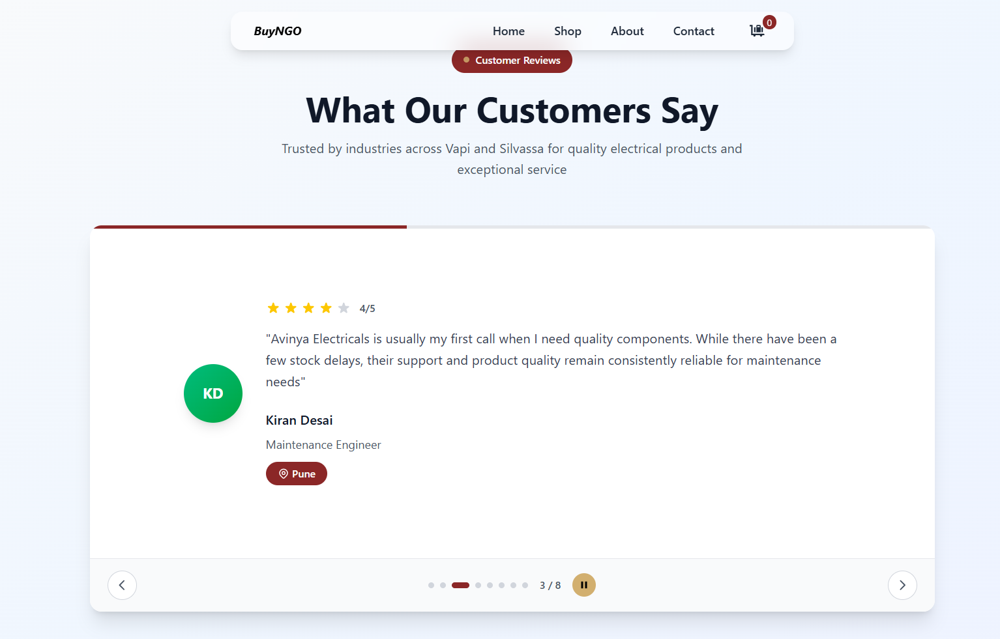

<h1 align="center">🛍️ BuyNGo</h1>
<p align="center">
  A sleek and modern eCommerce web app built with <strong>React</strong>, <strong>Tailwind CSS</strong> & <strong>JavaScript</strong>. Featuring cart, inquiry, search, checkout & more!
</p>

<!-- <p align="center">
  
</p> -->

---

## ✨ Features

- 🔎 **Smart Product Search**
- 🛒 **Cart Management with LocalStorage**
- 📩 **Inquiry Modal for Direct Product Queries**
- 💳 **Smooth Checkout Flow**
- 🌙 **Dark / Light Mode Toggle**
- 🎯 **Responsive, Animated & UX-optimized UI**

---

## 📸 Screenshots

All UI previews are stored inside the `src/assets/images/` folder. Below are visuals for each major page.

---

### 🏠 Home Page

**First Image**  


**Second Image**  


**Third Image**  


---

### 🧾 Product Page

**First Image**  


**Second Image**  


**Third Image**  


---

### 🛒 Cart Page

**First Image**  


**Second Image**  


**Third Image**  


---

### 📩 Inquiry Modal

**First Image**  


**Second Image**  


**Third Image**  


---

### 💳 Checkout Page

**First Image**  


**Second Image**  


**Third Image**  

|  |  |  |


---

## 🧱 Folder Structure

LAVISH-CLOTH/
├
│   ├── home/
│   │   ├── home1.png
│   │   ├── home2.png
│   │   └── home3.png
│   ├── product/
│   │   ├── product1.png
│   │   ├── product2.png
│   │   └── product3.png
│   ├── cart/
│   │   ├── cart1.png
│   │   ├── cart2.png
│   │   └── cart3.png
│   ├── inquiry/
│   │   ├── inquiry1.png
│   │   ├── inquiry2.png
│   │   └── inquiry3.png
│   ├── checkout/
│   │   ├── checkout1.png
│   │   ├── checkout2.png
│   │   └── checkout3.png
│   └── misc/
│       └── logo.png


---

## ⚙️ Tech Stack

- ⚛️ React (with Vite)
- 🎨 Tailwind CSS
- 🧠 Context API for Cart
- 🔗 React Router
- 💾 LocalStorage for persistence

---

## 🚀 Getting Started

### 🔧 Requirements

- Node.js 16+
- npm or yarn

### 📥 Installation

```bash
git clone https://github.com/YOUR_USERNAME/buyngo.git
cd buyngo
npm install
